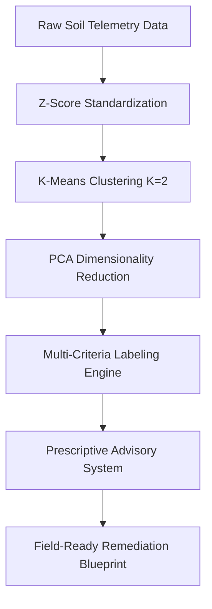

# 🌾 EthioSoil ML: Unsupervised Soil Clustering & Prescriptive Advisory System

An end-to-end unsupervised machine learning pipeline that ingests multi-variate soil telemetry data, partitions fields into dynamic management zones, and layers an automated rule engine to output localized land-remediation blueprints.

---

## 🚀 Core Features
* **Scale-Agnostic Preprocessing:** Handles severe numeric scale disparities (e.g., narrow pH shifts vs. thousands of ppm of Nitrogen) using $Z$-score standardization.
* **Dual-Partition Clustering:** Configures K-Means ($K=2$) to naturally isolate stable, functional agricultural matrices from heavily degraded anomaly zones.
* **Dimensionality Reduction & Interpretability:** Compresses 5D space into a 2D projection via Principal Component Analysis (PCA) to expose a clean "Soil Stress Vector" boundary at $PC_1 = 0$.
* **Hybrid Post-Clustering Evaluation:** Features a dynamic evaluation matrix that weights nutrient Z-scores against a non-linear, raw absolute deviation penalty for soil pH.
* **Prescriptive Rule Engine:** Bypasses abstract numerical labels to generate actionable, real-world text remediation guides (e.g., lime requirements, freshwater field leaching, and catch-cropping mandates).

---

## 📊 Dataset Profile
The underlying dataset consists of **908,867 unique agricultural rows** monitoring 5 critical agronomic telemetry features.

### Descriptive Statistical Distribution
| Feature | Count | Mean | Std | Min | 50% (Median) | Max |
| :--- | :---: | :---: | :---: | :---: | :---: | :---: |
| **Nitrogen** | 908,867 | 1,363.91 | 988.11 | 0.54 | 1,091.06 | 19,861.14 |
| **Phosphorus** | 908,867 | 13.01 | 9.39 | 0.0001 | 11.75 | 603.64 |
| **Potassium** | 908,867 | 420.32 | 208.29 | 19.27 | 400.74 | 2,647.79 |
| **pH** | 908,867 | 7.20 | 0.91 | 4.29 | 7.35 | 9.81 |
| **EC (Salinity)** | 908,867 | 332.31 | 607.36 | 0.10 | 140.71 | 16,109.97 |

> 💡 **The Fertilizer Accumulation Paradox:** The model unmasks an important counter-intuitive reality—the **"Unviable"** cluster maintains significantly *higher* phosphorus and potassium accumulations. This is driven by chemical fixation at high pH ($\text{pH} \ge 8.0$) and repetitive, ineffective fertilizer applications on crops already failing from salinity stress.

---

## 🛠️ Pipeline Architecture



---

## 📦 Quick Start & Execution

### Prerequisites
```bash
pip install numpy pandas scikit-learn matplotlib seaborn
```

### Core Pipeline Execution
```bash
git clone [https://github.com/your-username/ethio-soil-precision-ml.git](https://github.com/your-username/ethio-soil-precision-ml.git)
cd ethio-soil-precision-ml
python K-Means Soil Data Model.ipynb
```

---

## 🖥️ Sample Operational Output
When a field is flagged as unviable, the engine skips the abstract centroids and logs explicit field directions based on raw metric boundary overrides:

```text
=== AUTOMATED INFERENCE AUDIT: RUNNING SOIL REMEDIATION ADVISORY ENGINE ===

--- REMEDIATION PROFILE FOR ETHIOPIAN SMALLHOLDER PLOT ID: 4102 ---
Raw Telemetry Metrics -> N: 412.0 | P: 542.1 | K: 610.2 | pH: 8.42 | EC: 12450.6

  1. ⚠️ HIGH ALKALINITY (pH: 8.42): Sodic/Calcareous soil detected. 
     Incorporate Elemental Sulfur or Aluminum Sulfate to safely lower pH levels.
     
  2. 🚨 CRITICAL SALINITY HAZARD (EC: 12450.60): Severe salt accumulation. 
     Initiate freshwater leaching/flushing and improve drainage to protect crop root osmolarity.
     
  3. ⚠️ PHOSPHORUS ACCUMULATION (P: 542.10): Hyper-saturated fertilizer buildup. 
     Immediately halt NPK/DAP inputs and use deep-rooted catch crops to deplete soil P reserves.
================================================================================
```

---

## ⚠️ Algorithmic Limitations & Next Steps
* **Outlier Gravitation:** Because K-Means minimizes squared Euclidean distances, extreme salinity points ($\approx 16,000\ \mu\text{S/cm}$) exert a heavy mathematical pull on moving centroids, biasing the algorithm to act primarily as an anomaly quarantine system.
* **Future Work:** Migrating from K-Means to density-based spatial clustering (**DBSCAN**) to isolate hyper-saline anomalies natively as noise points, and expanding feature vectors to ingest geospatial, locational, and environmental parameters (elevation, slope, and mean rainfall).

